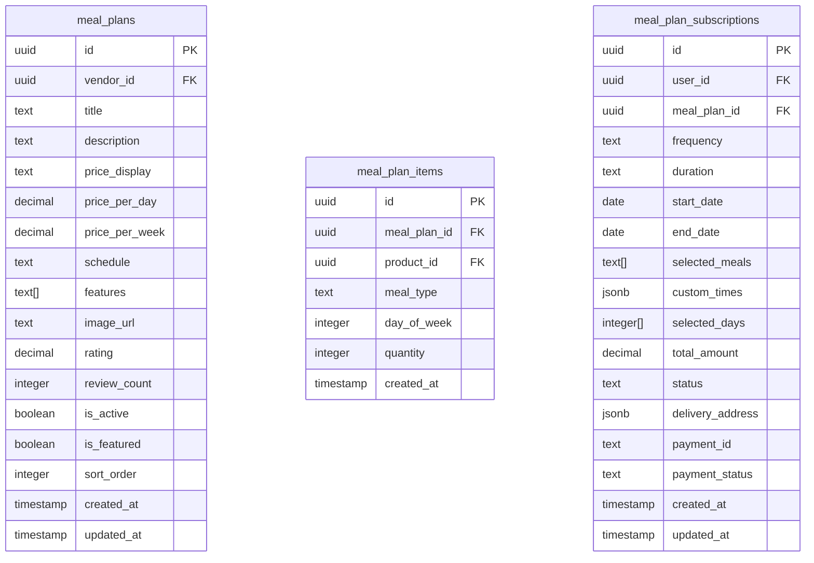
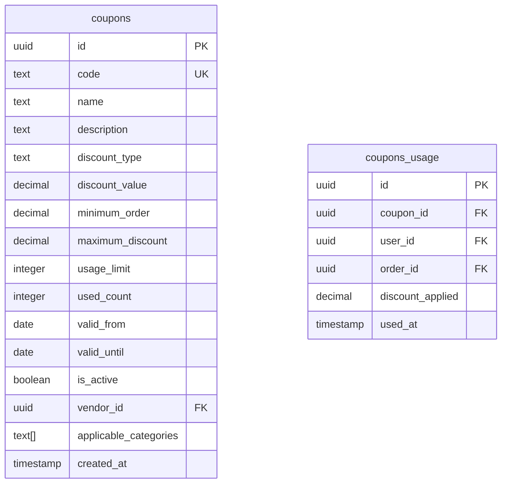
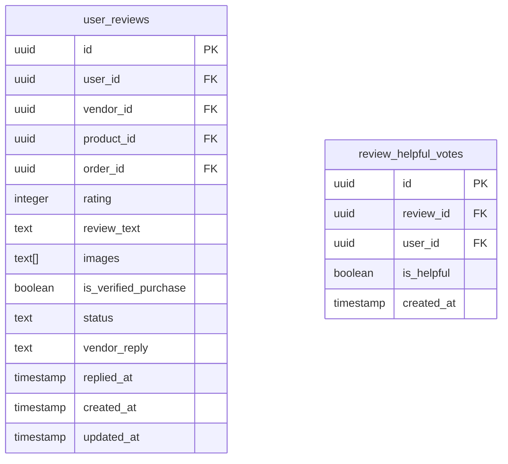
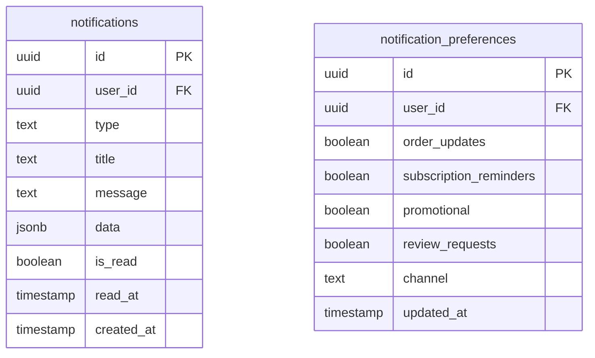
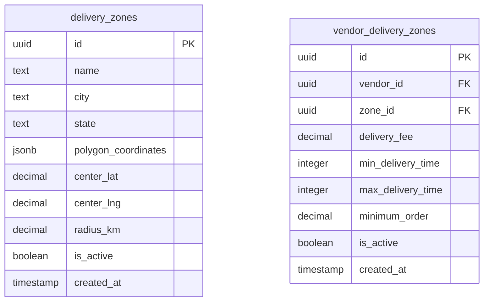
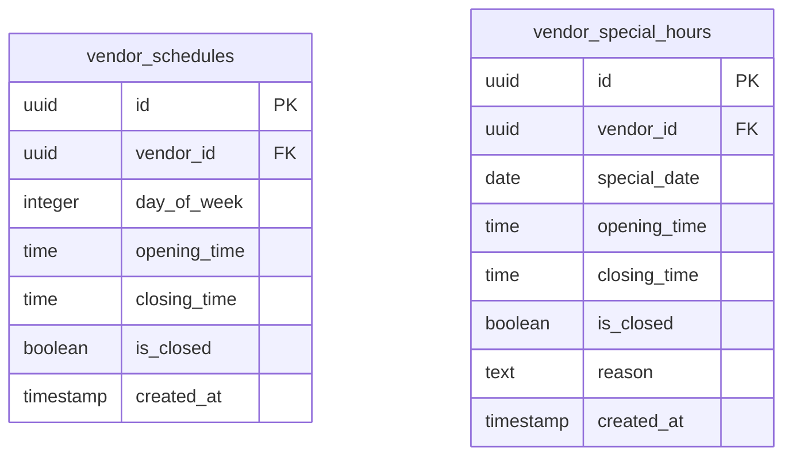
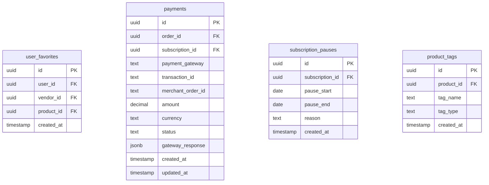

# Gutzo Marketplace - Database Schema & UML Design

A comprehensive database design for the Gutzo multi-vendor healthy meals
marketplace, covering all use cases from the current UI implementation.

---

## Current Database Analysis

### Existing Tables (14 tables in `data.sql`)

| Table                     | Purpose                             | Status      |
| ------------------------- | ----------------------------------- | ----------- |
| `users`                   | User authentication & profile       | ✅ Complete |
| `vendors`                 | Vendor/restaurant information       | ✅ Complete |
| `products`                | Menu items/products                 | ✅ Complete |
| `categories`              | Product categories                  | ✅ Complete |
| `cart`                    | Shopping cart                       | ✅ Complete |
| `orders`                  | Order management                    | ✅ Complete |
| `order_items`             | Items within orders                 | ✅ Complete |
| `product_subscriptions`   | Meal plan subscriptions             | ✅ Complete |
| `subscription_items`      | Items within subscriptions          | ✅ Complete |
| `subscription_deliveries` | Delivery tracking for subscriptions | ✅ Complete |
| `user_addresses`          | User delivery addresses             | ✅ Complete |
| `otp_verification`        | Phone OTP authentication            | ✅ Complete |
| `kv_store_6985f4e9`       | Key-value store (internal)          | ✅ Internal |

---

## Identified Gaps & New Tables Required

Based on UI analysis, the following tables are **missing or need enhancement**:

### 1. Meal Plans (Currently Mock Data)

**Source:** `WeeklyMealPlansSection.tsx` - Uses static array, not connected to
database

### 2. Coupons & Discounts

**Source:** Payment flows reference discounts but no table exists

### 3. Reviews & Ratings

**Source:** Vendors/Products show ratings but no review system exists

### 4. Notifications

**Source:** Order status updates, subscription reminders need tracking

### 5. Delivery Zones

**Source:** Location-based vendor filtering needs zone management

### 6. Vendor Schedules

**Source:** Opening hours stored as JSONB, needs proper structure

---

## Complete Entity Relationship Diagram

```mermaid
erDiagram
    %% Core User Entities
    users ||--o{ user_addresses : "has"
    users ||--o{ orders : "places"
    users ||--o{ cart : "has"
    users ||--o{ product_subscriptions : "subscribes"
    users ||--o{ user_reviews : "writes"
    users ||--o{ user_favorites : "saves"
    users ||--o{ notifications : "receives"
    
    %% Vendor Entities
    vendors ||--o{ products : "offers"
    vendors ||--o{ orders : "receives"
    vendors ||--o{ product_subscriptions : "fulfills"
    vendors ||--o{ vendor_schedules : "has"
    vendors ||--o{ delivery_zones : "serves"
    vendors ||--o{ meal_plans : "provides"
    vendors ||--o{ user_reviews : "receives"
    
    %% Product Entities
    products ||--o{ cart : "added_to"
    products ||--o{ order_items : "included_in"
    products ||--o{ subscription_items : "part_of"
    products }o--|| categories : "belongs_to"
    products ||--o{ product_tags : "has"
    products ||--o{ meal_plan_items : "included_in"
    
    %% Order Entities
    orders ||--o{ order_items : "contains"
    orders ||--o| coupons_usage : "applies"
    orders ||--o| payments : "has"
    
    %% Subscription Entities
    product_subscriptions ||--o{ subscription_items : "includes"
    product_subscriptions ||--o{ subscription_deliveries : "schedules"
    product_subscriptions ||--o{ subscription_pauses : "paused_by"
    
    %% Meal Plan Entities
    meal_plans ||--o{ meal_plan_items : "contains"
    meal_plans ||--o{ meal_plan_subscriptions : "purchased_as"
    
    %% Coupon Entities
    coupons ||--o{ coupons_usage : "tracked_by"
    
    %% Core Tables
    users {
        uuid id PK
        text phone UK
        text name
        text email
        boolean verified
        timestamp created_at
        timestamp updated_at
    }
    
    vendors {
        uuid id PK
        text name
        text description
        text image
        decimal rating
        text delivery_time
        decimal minimum_order
        decimal delivery_fee
        text cuisine_type
        text address
        text phone
        boolean is_active
        boolean is_featured
        jsonb opening_hours
        text[] tags
        timestamp created_at
        timestamp updated_at
    }
    
    products {
        uuid id PK
        uuid vendor_id FK
        text name
        text description
        decimal price
        text image_url
        text category
        text[] tags
        boolean is_available
        integer preparation_time
        jsonb nutritional_info
        text[] ingredients
        text[] allergens
        text portion_size
        text spice_level
        boolean is_featured
        integer sort_order
        timestamp created_at
        timestamp updated_at
    }
    
    categories {
        uuid id PK
        text name UK
        text description
        text image_url
        text icon_name
        integer sort_order
        boolean is_active
        timestamp created_at
    }
    
    cart {
        uuid id PK
        varchar user_phone
        uuid product_id FK
        uuid vendor_id FK
        integer quantity
        timestamp created_at
        timestamp updated_at
    }
    
    orders {
        uuid id PK
        uuid user_id FK
        uuid vendor_id FK
        text order_number UK
        text status
        text order_type
        decimal subtotal
        decimal delivery_fee
        decimal packaging_fee
        decimal taxes
        decimal discount_amount
        decimal total_amount
        jsonb delivery_address
        text delivery_phone
        timestamp estimated_delivery_time
        timestamp actual_delivery_time
        text payment_id
        text payment_method
        text payment_status
        text special_instructions
        timestamp created_at
        timestamp updated_at
    }
    
    order_items {
        uuid id PK
        uuid order_id FK
        uuid product_id FK
        uuid vendor_id FK
        text product_name
        text product_description
        text product_image_url
        integer quantity
        decimal unit_price
        decimal total_price
        text special_instructions
        jsonb customizations
        timestamp created_at
    }
    
    user_addresses {
        uuid id PK
        uuid user_id FK
        address_type type
        varchar label
        varchar street
        varchar area
        varchar landmark
        text full_address
        varchar city
        varchar state
        varchar country
        varchar postal_code
        decimal latitude
        decimal longitude
        text delivery_instructions
        boolean is_default
        timestamp created_at
        timestamp updated_at
    }
    
    product_subscriptions {
        uuid id PK
        uuid user_id FK
        uuid vendor_id FK
        text subscription_name
        text frequency
        integer duration_weeks
        date start_date
        date end_date
        decimal total_amount
        decimal amount_per_delivery
        text status
        text delivery_time
        integer[] delivery_days
        jsonb delivery_address
        text payment_id
        text payment_method
        text payment_status
        timestamp created_at
        timestamp updated_at
    }
    
    subscription_items {
        uuid id PK
        uuid subscription_id FK
        uuid product_id FK
        text product_name
        integer quantity
        decimal unit_price
        timestamp created_at
    }
    
    subscription_deliveries {
        uuid id PK
        uuid subscription_id FK
        uuid order_id FK
        date scheduled_date
        text delivery_status
        timestamp delivered_at
        text notes
        timestamp created_at
        timestamp updated_at
    }
    
    otp_verification {
        uuid id PK
        text phone UK
        text otp
        timestamp expires_at
        boolean verified
        integer attempts
        timestamp created_at
        timestamp verified_at
    }
```



---

## New Tables Design

### 1. meal_plans (For Weekly Meal Plans Section)



**SQL Definition:**

```sql
-- Meal Plans Table (replaces static mealPlans array in WeeklyMealPlansSection.tsx)
CREATE TABLE public.meal_plans (
    id uuid DEFAULT gen_random_uuid() NOT NULL PRIMARY KEY,
    vendor_id uuid REFERENCES public.vendors(id) ON DELETE CASCADE,
    title text NOT NULL,
    description text,
    price_display text NOT NULL, -- e.g., "₹89/day" or "₹1100/week"
    price_per_day numeric(10,2),
    price_per_week numeric(10,2),
    schedule text NOT NULL, -- e.g., "Mon – Sat · Lunch/Dinner"
    features text[] DEFAULT '{}',
    image_url text,
    rating numeric(2,1) DEFAULT 4.5,
    review_count integer DEFAULT 0,
    is_active boolean DEFAULT true,
    is_featured boolean DEFAULT false,
    sort_order integer DEFAULT 0,
    created_at timestamp with time zone DEFAULT now(),
    updated_at timestamp with time zone DEFAULT now()
);

-- Meal Plan Items (products included in a meal plan)
CREATE TABLE public.meal_plan_items (
    id uuid DEFAULT gen_random_uuid() NOT NULL PRIMARY KEY,
    meal_plan_id uuid REFERENCES public.meal_plans(id) ON DELETE CASCADE,
    product_id uuid REFERENCES public.products(id) ON DELETE SET NULL,
    meal_type text NOT NULL CHECK (meal_type IN ('breakfast', 'lunch', 'dinner', 'snack')),
    day_of_week integer CHECK (day_of_week >= 0 AND day_of_week <= 6), -- 0=Sunday
    quantity integer DEFAULT 1,
    created_at timestamp with time zone DEFAULT now()
);

-- Meal Plan Subscriptions (user purchases of meal plans)
CREATE TABLE public.meal_plan_subscriptions (
    id uuid DEFAULT gen_random_uuid() NOT NULL PRIMARY KEY,
    user_id uuid REFERENCES public.users(id) ON DELETE CASCADE,
    meal_plan_id uuid REFERENCES public.meal_plans(id),
    frequency text NOT NULL CHECK (frequency IN ('weekly', 'monthly')),
    duration text NOT NULL, -- e.g., 'Trial Week', '1 Month', '3 Months', 'Auto-renew'
    start_date date NOT NULL,
    end_date date,
    selected_meals text[] DEFAULT '{lunch,dinner}',
    custom_times jsonb DEFAULT '{}', -- {"Lunch": "1:00 PM", "Dinner": "8:00 PM"}
    selected_days integer[] DEFAULT '{1,2,3,4,5,6}', -- Mon-Sat
    total_amount numeric(10,2) NOT NULL,
    status text DEFAULT 'active' CHECK (status IN ('active', 'paused', 'cancelled', 'completed')),
    delivery_address jsonb NOT NULL,
    payment_id text,
    payment_status text DEFAULT 'pending',
    created_at timestamp with time zone DEFAULT now(),
    updated_at timestamp with time zone DEFAULT now()
);
```

---

### 2. coupons (Discount System)



**SQL Definition:**

```sql
-- Coupons Table
CREATE TABLE public.coupons (
    id uuid DEFAULT gen_random_uuid() NOT NULL PRIMARY KEY,
    code text NOT NULL UNIQUE,
    name text NOT NULL,
    description text,
    discount_type text NOT NULL CHECK (discount_type IN ('percentage', 'fixed')),
    discount_value numeric(10,2) NOT NULL,
    minimum_order numeric(10,2) DEFAULT 0,
    maximum_discount numeric(10,2), -- For percentage discounts
    usage_limit integer, -- NULL = unlimited
    used_count integer DEFAULT 0,
    valid_from date DEFAULT CURRENT_DATE,
    valid_until date,
    is_active boolean DEFAULT true,
    vendor_id uuid REFERENCES public.vendors(id) ON DELETE CASCADE, -- NULL = platform-wide
    applicable_categories text[], -- NULL = all categories
    created_at timestamp with time zone DEFAULT now()
);

-- Coupon Usage Tracking
CREATE TABLE public.coupons_usage (
    id uuid DEFAULT gen_random_uuid() NOT NULL PRIMARY KEY,
    coupon_id uuid REFERENCES public.coupons(id) ON DELETE CASCADE,
    user_id uuid REFERENCES public.users(id) ON DELETE CASCADE,
    order_id uuid REFERENCES public.orders(id) ON DELETE SET NULL,
    discount_applied numeric(10,2) NOT NULL,
    used_at timestamp with time zone DEFAULT now(),
    UNIQUE(coupon_id, user_id, order_id)
);
```

---

### 3. user_reviews (Review & Rating System)



**SQL Definition:**

```sql
-- User Reviews Table
CREATE TABLE public.user_reviews (
    id uuid DEFAULT gen_random_uuid() NOT NULL PRIMARY KEY,
    user_id uuid REFERENCES public.users(id) ON DELETE CASCADE,
    vendor_id uuid REFERENCES public.vendors(id) ON DELETE CASCADE,
    product_id uuid REFERENCES public.products(id) ON DELETE SET NULL,
    order_id uuid REFERENCES public.orders(id) ON DELETE SET NULL,
    rating integer NOT NULL CHECK (rating >= 1 AND rating <= 5),
    review_text text,
    images text[] DEFAULT '{}',
    is_verified_purchase boolean DEFAULT false,
    status text DEFAULT 'published' CHECK (status IN ('pending', 'published', 'hidden', 'removed')),
    vendor_reply text,
    replied_at timestamp with time zone,
    created_at timestamp with time zone DEFAULT now(),
    updated_at timestamp with time zone DEFAULT now(),
    UNIQUE(user_id, order_id, product_id)
);

-- Review Helpful Votes
CREATE TABLE public.review_helpful_votes (
    id uuid DEFAULT gen_random_uuid() NOT NULL PRIMARY KEY,
    review_id uuid REFERENCES public.user_reviews(id) ON DELETE CASCADE,
    user_id uuid REFERENCES public.users(id) ON DELETE CASCADE,
    is_helpful boolean NOT NULL,
    created_at timestamp with time zone DEFAULT now(),
    UNIQUE(review_id, user_id)
);

-- Create indexes
CREATE INDEX idx_reviews_vendor ON public.user_reviews(vendor_id);
CREATE INDEX idx_reviews_product ON public.user_reviews(product_id);
CREATE INDEX idx_reviews_rating ON public.user_reviews(rating);
```

---

### 4. notifications (User Notifications)



**SQL Definition:**

```sql
-- Notifications Table
CREATE TABLE public.notifications (
    id uuid DEFAULT gen_random_uuid() NOT NULL PRIMARY KEY,
    user_id uuid REFERENCES public.users(id) ON DELETE CASCADE,
    type text NOT NULL CHECK (type IN (
        'order_placed', 'order_confirmed', 'order_preparing', 'order_ready', 
        'order_delivered', 'order_cancelled',
        'subscription_reminder', 'subscription_renewed', 'subscription_paused',
        'payment_success', 'payment_failed',
        'promotional', 'system'
    )),
    title text NOT NULL,
    message text NOT NULL,
    data jsonb DEFAULT '{}', -- Reference IDs, links, etc.
    is_read boolean DEFAULT false,
    read_at timestamp with time zone,
    created_at timestamp with time zone DEFAULT now()
);

-- Notification Preferences
CREATE TABLE public.notification_preferences (
    id uuid DEFAULT gen_random_uuid() NOT NULL PRIMARY KEY,
    user_id uuid REFERENCES public.users(id) ON DELETE CASCADE UNIQUE,
    order_updates boolean DEFAULT true,
    subscription_reminders boolean DEFAULT true,
    promotional boolean DEFAULT true,
    review_requests boolean DEFAULT true,
    channel text DEFAULT 'push' CHECK (channel IN ('push', 'sms', 'email', 'all')),
    updated_at timestamp with time zone DEFAULT now()
);

-- Indexes
CREATE INDEX idx_notifications_user ON public.notifications(user_id);
CREATE INDEX idx_notifications_unread ON public.notifications(user_id) WHERE is_read = false;
```

---

### 5. delivery_zones (Location-Based Delivery)



**SQL Definition:**

```sql
-- Delivery Zones Table
CREATE TABLE public.delivery_zones (
    id uuid DEFAULT gen_random_uuid() NOT NULL PRIMARY KEY,
    name text NOT NULL,
    city text NOT NULL DEFAULT 'Coimbatore',
    state text NOT NULL DEFAULT 'Tamil Nadu',
    polygon_coordinates jsonb, -- GeoJSON polygon
    center_lat numeric(10,8),
    center_lng numeric(11,8),
    radius_km numeric(5,2),
    is_active boolean DEFAULT true,
    created_at timestamp with time zone DEFAULT now()
);

-- Vendor Delivery Zone Mapping
CREATE TABLE public.vendor_delivery_zones (
    id uuid DEFAULT gen_random_uuid() NOT NULL PRIMARY KEY,
    vendor_id uuid REFERENCES public.vendors(id) ON DELETE CASCADE,
    zone_id uuid REFERENCES public.delivery_zones(id) ON DELETE CASCADE,
    delivery_fee numeric(10,2) DEFAULT 0,
    min_delivery_time integer DEFAULT 20, -- minutes
    max_delivery_time integer DEFAULT 35, -- minutes
    minimum_order numeric(10,2) DEFAULT 0,
    is_active boolean DEFAULT true,
    created_at timestamp with time zone DEFAULT now(),
    UNIQUE(vendor_id, zone_id)
);

-- Indexes
CREATE INDEX idx_delivery_zones_city ON public.delivery_zones(city);
CREATE INDEX idx_vendor_zones_vendor ON public.vendor_delivery_zones(vendor_id);
```

---

### 6. vendor_schedules (Operating Hours)



**SQL Definition:**

```sql
-- Vendor Regular Schedules
CREATE TABLE public.vendor_schedules (
    id uuid DEFAULT gen_random_uuid() NOT NULL PRIMARY KEY,
    vendor_id uuid REFERENCES public.vendors(id) ON DELETE CASCADE,
    day_of_week integer NOT NULL CHECK (day_of_week >= 0 AND day_of_week <= 6), -- 0=Sunday
    opening_time time,
    closing_time time,
    is_closed boolean DEFAULT false,
    created_at timestamp with time zone DEFAULT now(),
    UNIQUE(vendor_id, day_of_week)
);

-- Vendor Special Hours (holidays, events)
CREATE TABLE public.vendor_special_hours (
    id uuid DEFAULT gen_random_uuid() NOT NULL PRIMARY KEY,
    vendor_id uuid REFERENCES public.vendors(id) ON DELETE CASCADE,
    special_date date NOT NULL,
    opening_time time,
    closing_time time,
    is_closed boolean DEFAULT false,
    reason text, -- e.g., "Diwali Holiday", "Staff Training"
    created_at timestamp with time zone DEFAULT now(),
    UNIQUE(vendor_id, special_date)
);

-- Indexes
CREATE INDEX idx_vendor_schedules_vendor ON public.vendor_schedules(vendor_id);
CREATE INDEX idx_special_hours_date ON public.vendor_special_hours(special_date);
```

---

### 7. Additional Supporting Tables



**SQL Definition:**

```sql
-- User Favorites
CREATE TABLE public.user_favorites (
    id uuid DEFAULT gen_random_uuid() NOT NULL PRIMARY KEY,
    user_id uuid REFERENCES public.users(id) ON DELETE CASCADE,
    vendor_id uuid REFERENCES public.vendors(id) ON DELETE CASCADE,
    product_id uuid REFERENCES public.products(id) ON DELETE CASCADE,
    created_at timestamp with time zone DEFAULT now(),
    UNIQUE(user_id, COALESCE(vendor_id, '00000000-0000-0000-0000-000000000000'), COALESCE(product_id, '00000000-0000-0000-0000-000000000000'))
);

-- Payments (detailed payment tracking)
CREATE TABLE public.payments (
    id uuid DEFAULT gen_random_uuid() NOT NULL PRIMARY KEY,
    order_id uuid REFERENCES public.orders(id) ON DELETE SET NULL,
    subscription_id uuid REFERENCES public.product_subscriptions(id) ON DELETE SET NULL,
    payment_gateway text NOT NULL, -- 'phonepe', 'razorpay', 'paytm'
    transaction_id text UNIQUE,
    merchant_order_id text,
    amount numeric(10,2) NOT NULL,
    currency text DEFAULT 'INR',
    status text NOT NULL CHECK (status IN ('pending', 'initiated', 'success', 'failed', 'refunded')),
    gateway_response jsonb DEFAULT '{}',
    created_at timestamp with time zone DEFAULT now(),
    updated_at timestamp with time zone DEFAULT now()
);

-- Subscription Pauses
CREATE TABLE public.subscription_pauses (
    id uuid DEFAULT gen_random_uuid() NOT NULL PRIMARY KEY,
    subscription_id uuid REFERENCES public.product_subscriptions(id) ON DELETE CASCADE,
    pause_start date NOT NULL,
    pause_end date,
    reason text,
    created_at timestamp with time zone DEFAULT now()
);

-- Product Tags (normalized from text[])
CREATE TABLE public.product_tags (
    id uuid DEFAULT gen_random_uuid() NOT NULL PRIMARY KEY,
    product_id uuid REFERENCES public.products(id) ON DELETE CASCADE,
    tag_name text NOT NULL,
    tag_type text DEFAULT 'general' CHECK (tag_type IN ('dietary', 'cuisine', 'general', 'health')),
    created_at timestamp with time zone DEFAULT now(),
    UNIQUE(product_id, tag_name)
);

-- Indexes
CREATE INDEX idx_favorites_user ON public.user_favorites(user_id);
CREATE INDEX idx_payments_order ON public.payments(order_id);
CREATE INDEX idx_payments_transaction ON public.payments(transaction_id);
CREATE INDEX idx_subscription_pauses ON public.subscription_pauses(subscription_id);
```

---

## Complete System Diagram

```mermaid
flowchart TB
    subgraph Users["👤 User Domain"]
        U[users]
        UA[user_addresses]
        UF[user_favorites]
        NP[notification_preferences]
    end
    
    subgraph Vendors["🏪 Vendor Domain"]
        V[vendors]
        VS[vendor_schedules]
        VSH[vendor_special_hours]
        VDZ[vendor_delivery_zones]
    end
    
    subgraph Products["🍱 Product Domain"]
        P[products]
        C[categories]
        PT[product_tags]
    end
    
    subgraph Orders["📦 Order Domain"]
        O[orders]
        OI[order_items]
        CART[cart]
    end
    
    subgraph Subscriptions["🔄 Subscription Domain"]
        PS[product_subscriptions]
        SI[subscription_items]
        SD[subscription_deliveries]
        SP[subscription_pauses]
    end
    
    subgraph MealPlans["🍽️ Meal Plan Domain"]
        MP[meal_plans]
        MPI[meal_plan_items]
        MPS[meal_plan_subscriptions]
    end
    
    subgraph Payments["💳 Payment Domain"]
        PAY[payments]
        CPN[coupons]
        CPU[coupons_usage]
    end
    
    subgraph Reviews["⭐ Review Domain"]
        UR[user_reviews]
        RHV[review_helpful_votes]
    end
    
    subgraph Notifications["🔔 Notification Domain"]
        N[notifications]
    end
    
    subgraph Delivery["🚚 Delivery Domain"]
        DZ[delivery_zones]
    end
    
    subgraph Auth["🔐 Auth Domain"]
        OTP[otp_verification]
    end
    
    U --> UA
    U --> UF
    U --> NP
    U --> O
    U --> CART
    U --> PS
    U --> MPS
    U --> UR
    U --> N
    
    V --> P
    V --> VS
    V --> VSH
    V --> VDZ
    V --> MP
    V --> O
    
    P --> PT
    P --> C
    P --> OI
    P --> SI
    P --> MPI
    
    O --> OI
    O --> PAY
    O --> CPU
    O --> UR
    
    PS --> SI
    PS --> SD
    PS --> SP
    PS --> PAY
    
    MP --> MPI
    MP --> MPS
    
    VDZ --> DZ
    
    CPN --> CPU
```



---

## Edge Cases Covered

### User Edge Cases

1. **Multiple Addresses** - User can have home, work, and custom addresses
2. **Phone Number Change** - OTP verification for new number
3. **Guest Cart Migration** - Cart preserved after login
4. **Default Address Toggle** - Only one default per user (trigger exists)

### Order Edge Cases

1. **Cross-Vendor Orders** - Currently blocked (single vendor per cart)
2. **Failed Payments** - Order status tracking with retry capability
3. **Order Cancellation** - Time-based cancellation window
4. **Refunds** - Linked to payments table

### Subscription Edge Cases

1. **Pause Functionality** - Track pause periods separately
2. **Skip Specific Days** - Custom dates support
3. **Auto-Renewal** - Duration field handles this
4. **Meal Slot Changes** - JSONB custom_times for flexibility
5. **Address Updates Mid-Subscription** - delivery_address is JSONB

### Vendor Edge Cases

1. **Holiday Closures** - vendor_special_hours table
2. **Variable Operating Hours** - Per-day schedule support
3. **Zone-Based Delivery Fees** - Different fees per zone
4. **Dynamic Delivery Times** - Zone-specific min/max times

### Product Edge Cases

1. **Stock Out** - is_available boolean
2. **Price Changes** - Order items store historical prices
3. **Category Changes** - Soft reference via text field
4. **Seasonal Items** - is_available can be toggled

### Payment Edge Cases

1. **Gateway Failures** - Multiple status states
2. **Partial Refunds** - Amount tracking in payments
3. **Multiple Payment Attempts** - Transaction history preserved

---

## Verification Plan

Since this is a **design document** (not code implementation), verification will
be manual:

### Manual Verification Steps

1. **User Reviews Document** - Verify all tables from `data.sql` are correctly
   documented
2. **Frontend Alignment** - Cross-check with TypeScript interfaces in
   `src/types/`
3. **Use Case Coverage** - Verify all UI flows have corresponding database
   support

### No Automated Tests

- This is a design artifact, not executable code
- Implementation would follow after approval

---

## User Review Required

> [!IMPORTANT]
> This design document needs your review before proceeding with SQL migration
> file creation.

**Questions for Review:**

1. Should meal plans be vendor-specific or platform-managed?
2. Do you need coupon codes per-vendor or platform-wide only?
3. Should reviews allow image uploads?
4. Is the notification system needed now or for future phases?
